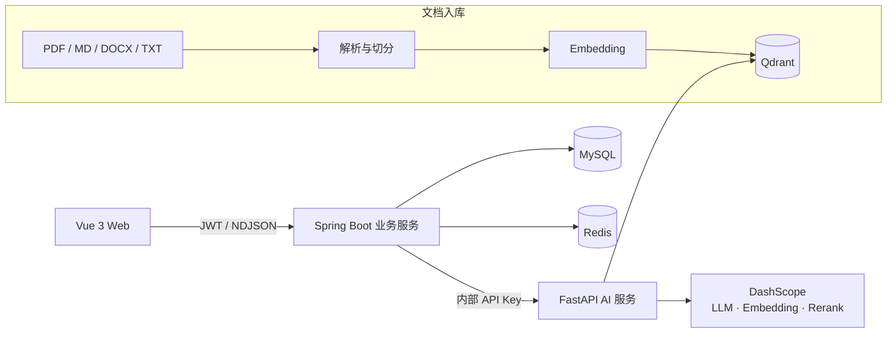

# 知途 AI（ZhiTu AI）

[](https://github.com/Hidingbrass/rag-knowledge-base/actions/workflows/ci.yml)

面向学习与求职场景的个人 AI 工作台：把 PDF、Markdown、Word、TXT 等资料变成可追溯的 AI 学习知识库，并提供简历分析、岗位匹配、面试准备等求职工具。

> 项目重点不只是“调用大模型”，而是完整实现文档入库、混合检索、重排、引用校验、流式交互、安全防护、效果评测和调用监控等 AI 应用工程链路。

## 30 秒了解项目

知途 AI 包含两条相互补充的使用路径：

| 场景 | 用户可以做什么 | 核心能力 |
| --- | --- | --- |
| AI 学习资料库 | 上传八股文、课程讲义、技术文档，基于资料连续提问 | 小聊分流、多格式解析、混合检索、Rerank、拒答、引用来源、流式输出 |
| 求职工具箱 | 分析简历和 JD，生成匹配报告、优化建议与面试准备包 | 结构化抽取、岗位匹配、简历优化、面试题、STAR 回答、历史版本 |

适合用于展示的工程亮点：

- Spring Boot 负责用户、权限、资料库、会话和求职业务，FastAPI 专注模型编排与 RAG，两类服务职责清晰。
- Spring Boot 对纯问候、感谢和能力询问执行有限整句白名单匹配，直接返回可预测回复；包含实际知识问题的消息仍进入 RAG。
- Dense 向量召回与 Sparse 词法召回经 RRF 融合，再由 `qwen3-rerank` 重排，并执行阈值拒答与引用校验。
- AI 学习问答采用 NDJSON 端到端流式传输，问题发送后立即进入消息区，模型答案逐段显示。
- 记录模型成功率、延迟、Token、成本、重试等指标，并针对超时、限流、格式错误实现受控重试与降级。
- 覆盖提示词注入检测、敏感信息脱敏、资料库所有权校验、内部服务密钥和可选字段加密。
- 提供固定评测集、消融实验和自动化测试，使“回答效果更好”能够被验证，而不是依赖主观体验。

## 系统架构



浏览器只访问 Spring Boot 暴露的统一 API；FastAPI 作为内部 AI 服务，不默认映射到宿主机端口。

## 核心链路

### 1. 文档入库

1. 校验文件类型、大小和资料库归属。
2. 计算 SHA-256，避免同一资料重复上传。
3. MySQL 记录文档及处理状态。
4. FastAPI 解析 PDF、Markdown、DOCX 或 TXT，并完成文本切分。
5. 调用 DashScope Embedding，将向量和业务元数据写入 Qdrant。
6. 失败时返回可定位的错误并保留状态，避免前端无反馈地等待。

### 2. AI 伴学与 RAG 问答

1. Spring Boot 校验会话、资料库和所选文档权限，再对短消息执行确定性规则路由。
2. 纯问候、感谢和能力询问使用确定性模板直接回复，同时正常保存用户与助手消息，不调用模型服务。
3. 未命中直答规则的消息继续执行安全检查和向量化；“你好，请总结这份资料”这类混合消息不会被小聊规则截断。
4. 并行获取 Dense 与 Sparse 候选，使用 RRF 融合，并通过 Rerank 精排和文档级去重。
5. 相关度不足时拒答，避免脱离资料自由发挥；检索失败不会静默回退成无引用的通用模型回答。
6. Prompt 约束模型只基于上下文回答，并校验引用来源。
7. 两类回答复用同一套 NDJSON 事件和 MySQL 会话记录；RAG 回答额外返回来源和检索元数据。

### 3. 求职辅助

- 支持文本、文档和简历图片的结构化解析。
- 统一保存解析后的简历上下文，后续优化无需重复上传。
- 支持 JD 分析、岗位匹配、简历优化、面试准备、STAR 回答和投递材料生成。
- 结构化任务启用 JSON 输出约束和容错解析，降低模型返回格式不稳定导致的失败。
- 任务过程展示处理中、重试和完成状态，结果、收藏及版本记录持久化到 MySQL。

## 技术栈

| 层次 | 技术 |
| --- | --- |
| Web | Vue 3、Vite、Vue Router、Pinia、Axios |
| 业务服务 | Java 17、Spring Boot、Spring Security、Spring Data JPA、JWT |
| AI 服务 | Python、FastAPI、DashScope、Pydantic |
| 检索 | Qdrant、Dense Embedding、Sparse Lexical、RRF、Rerank |
| 数据 | MySQL、Redis |
| 工程化 | Docker Compose、Maven、pytest、Vitest、GitHub Actions |

## 快速启动

### 环境要求

- Docker Desktop 与 Docker Compose
- 可用的阿里云百炼 DashScope API Key
- 建议至少预留 6 GB 内存

### 1. 配置环境变量

```bash
cp .env.example .env
openssl rand -hex 32
```

编辑 `.env`，至少设置：

```dotenv
DASHSCOPE_API_KEY=你的_DashScope_Key
FASTAPI_API_KEY=使用上一步生成的随机值
JWT_SECRET=另一个足够长的随机值
```

`.env` 已被 Git 忽略，请勿将真实密钥提交到仓库。

### 2. 构建并启动

```bash
docker compose up -d --build
```

默认访问地址：

- Web：<http://127.0.0.1:8080/>
- 后端健康检查：<http://127.0.0.1:8080/api/health>
- Qdrant 控制台：<http://127.0.0.1:6333/dashboard>

若在 `.env` 中修改了 `BACKEND_HOST_PORT`，请将上述 `8080` 替换为对应端口。

### 3. 完成第一次体验

1. 注册账号并登录；项目不内置默认演示账号或虚构业务数据。
2. 创建学习资料库。
3. 上传 PDF、Markdown、DOCX 或 TXT 文件，等待状态变为处理完成。
4. 进入 AI 伴学页提问，观察检索状态、引用来源与流式答案。
5. 在求职工具箱上传简历，再补充目标岗位 JD，体验匹配、优化和面试准备。

常用运维命令：

```bash
docker compose ps
docker compose logs -f backend
docker compose logs -f ai-service
docker compose down
```

## 配置说明

完整示例见 [`.env.example`](./.env.example)，常用配置包括：

| 配置 | 用途 |
| --- | --- |
| `DASHSCOPE_API_KEY` | 调用大模型、Embedding 和 Rerank |
| `FASTAPI_API_KEY` | Spring Boot 与 FastAPI 的内部服务鉴权 |
| `JWT_SECRET` | 用户登录令牌签名 |
| `SENSITIVE_DATA_ENCRYPTION_KEY` | 可选，敏感字段加密密钥 |
| `BACKEND_HOST_PORT` | 后端映射到宿主机的端口，默认 `8080` |
| `AI_INPUT_PRICE_PER_1K` / `AI_OUTPUT_PRICE_PER_1K` | 调用成本估算 |

生成可选的敏感字段加密密钥：

```bash
openssl rand -base64 32
```

生产环境还应通过云密钥服务或部署平台注入密钥，并配置 HTTPS、数据库备份、日志保留周期和网络访问控制。

## API 概览

前端统一通过 `/api` 访问 Spring Boot。主要资源如下：

| 模块 | 示例路径 | 说明 |
| --- | --- | --- |
| 认证 | `/api/auth/register`、`/api/auth/login` | 注册、登录与 JWT 签发 |
| 资料库 | `/api/knowledge-bases` | 创建、查询、编辑、删除 |
| 文档 | `/api/knowledge-bases/{id}/documents` | 多格式资料上传与入库 |
| 对话 | `/api/chat/sessions` | 会话与历史消息 |
| 流式问答 | `/api/chat/sessions/{id}/ask/stream` | NDJSON 流式 RAG 回答 |
| 求职工具 | `/api/job-agent/**` | 简历、JD、匹配和面试任务 |
| AI 指标 | `/api/ai-call-logs/summary` | 成功率、延迟、Token 与成本 |

所有用户业务资源都会按当前 JWT 身份进行所有权校验，不信任客户端自行传入的 `userId`。

## 质量验证

### 自动化测试

```bash
make pre-submit
```

该命令统一执行密钥扫描、Markdown 链接检查、Docker Compose 配置检查、前端测试与构建、Python 测试和 Java 测试。

当前项目覆盖：

- FastAPI / RAG / 安全与故障处理：167 个测试。
- Spring Boot 业务、权限和接口：154 个测试。
- Vue 流式解析与状态交互：11 个测试。
- 合计：332 个自动化测试。

### RAG 消融评测

仓库内提供 6 份技术 PDF、26 个问题（20 个可回答、6 个应拒答）的固定评测集，用于比较不同检索方案：

| 检索方案 | Hit@6 | MRR |
| --- | ---: | ---: |
| Dense Vector | 1.0000 | 0.9500 |
| Sparse Lexical | 1.0000 | 0.8792 |
| Hybrid RRF | 1.0000 | 0.9250 |
| Hybrid RRF + Rerank | 1.0000 | 0.9750 |

最终链路的 Hit@3 为 `1.0000`，MRR 为 `0.9750`。这些结果用于可重复的内部回归和方案对比，不代表公开通用基准或生产环境效果。

复现实验：

```bash
python -m app.evaluation.evaluate_retrieval_ablation --dataset technical_docs
```

详细方法、逐题结果与边界说明见 [RAG 与 Rerank 实验报告](./docs/rag_rerank_experiment_report.md)。

## AI 可靠性与安全

| 问题 | 当前实现 |
| --- | --- |
| 如何减少幻觉 | 检索阈值拒答、上下文约束、引用返回、答案引用校验 |
| 如何处理问候等非知识输入 | Spring Boot 有限整句白名单与确定性模板，不进入 Embedding、检索或模型生成 |
| 如何验证输出 | 固定评测集、结构化 Schema 校验、引用一致性检查、人工确认 |
| 如何比较模型或链路 | 消融评测脚本、统一问题集与 Hit/MRR 等指标 |
| 如何监控调用 | 持久化成功率、耗时、Token、成本、重试次数和错误类型 |
| 如何控制成本 | 输入长度限制、分层 Token 上限、去重、缓存与成本估算 |
| 如何防提示词注入 | 输入检测、上下文边界、系统提示约束和危险内容阻断 |
| 如何处理敏感数据 | 日志脱敏、可选字段加密、用户数据隔离和最小化存储 |
| 如何设置人工审核 | 求职材料先生成草稿，由用户确认后使用，不自动投递 |
| 如何处理超时/API 失败 | 超时控制、有限重试、熔断、统一错误码和可见状态反馈 |

## 项目结构

```text
.
├── backend/                 # Spring Boot 业务服务
├── ai-service/              # FastAPI、RAG 与求职 AI 能力
├── frontend/                # Vue 3 用户界面
├── evaluation/              # 固定数据集、消融评测与结果
├── demo/                    # 可公开复现的技术文档样本
├── docs/                    # 架构、实验、演示和面试材料
├── scripts/                 # 启动检查、评测与工程脚本
├── docker-compose.yml       # 完整本地运行环境
├── Makefile                 # 统一开发与验证入口
└── .github/workflows/ci.yml # 持续集成
```

## 文档导航

README 负责快速了解和启动；深入内容按目的阅读：

- [启动与故障排查](./docs/startup_guide.md)
- [架构决策记录](./docs/architecture_decisions.md)
- [RAG 与 Rerank 实验报告](./docs/rag_rerank_experiment_report.md)
- [项目优化执行记录](./docs/optimization_execution_log.md)
- [完整演示脚本](./docs/final_demo_script.md)
- [项目面试问答](./docs/interview_full_project_qa.md)
- [简历项目描述](./docs/resume_full_project.md)

## 当前边界

- 当前定位是个人学习与求职辅助，不包含企业多租户、组织权限和计费系统。
- DOCX 以文本内容解析为主，复杂表格、扫描件和 OCR 仍可继续增强。
- 模型效果依赖资料质量、DashScope 服务状态与配置参数。
- AI 生成的求职建议仅供辅助判断，重要内容应由用户人工复核。

欢迎通过 Issue 反馈问题或提交改进建议。
