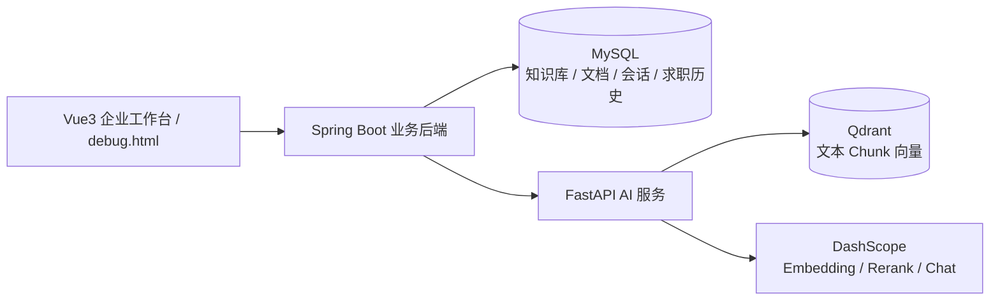

# RAG Knowledge Base

[](https://github.com/Hidingbrass/rag-knowledge-base/actions/workflows/ci.yml)

一个基于 Spring Boot、FastAPI、Qdrant、MySQL 和通义千问的企业知识库 RAG 学习项目。项目从底层实现 PDF 解析、文本切分、Embedding 入库、向量检索、RAG 问答、引用来源、拒答、Rerank、质量评测、知识库权限、聊天会话、求职辅助 Agent 和前端演示页，用于理解企业知识库问答系统与 AI 业务应用的核心链路。

当前项目重点不是直接使用 LangChain 等框架完成黑盒调用，而是手动拆解 RAG 的关键步骤，并用 Spring Boot 承载业务层、MySQL 保存业务数据、FastAPI 承载 AI 服务，建立可评测、可对比、可解释的优化闭环。

## 简历与面试材料

如果用于求职或面试，建议优先阅读：

- [项目一简历材料](docs/resume_project_one.md)
- [完整项目简历材料](docs/resume_full_project.md)
- [求职辅助 Agent 设计说明](docs/job_agent_design.md)
- [架构决策记录](docs/architecture_decisions.md)
- [项目一面试讲解手册](docs/interview_project_one.md)
- [完整项目高频面试问答](docs/interview_full_project_qa.md)
- [项目展示验收清单](docs/showcase_acceptance_checklist.md)
- [项目展示证据报告](docs/project_showcase_evidence.md)
- [一周完整项目冲刺计划](docs/one_week_full_project_plan.md)
- [RAG + Rerank 实验报告](docs/rag_rerank_experiment_report.md)
- [启动与部署说明](docs/startup_guide.md)
- [新电脑恢复项目指南](docs/new_machine_migration.md)

## 项目亮点

这个项目适合在简历中突出三类能力：

| 方向 | 体现 |
| --- | --- |
| AI 应用落地 | 手动实现 PDF 解析、Chunk 切分、Embedding、Qdrant 检索、Rerank、拒答、引用来源和评测 |
| 后端工程能力 | Spring Boot 分层、MySQL 持久化、权限校验、文档状态流转、会话消息、异常处理和测试 |
| 产品扩展能力 | 在同一套 Spring Boot + FastAPI 架构上扩展求职辅助 Agent、历史记录、简历版本、岗位收藏和对比决策 |

核心架构：



业务和 AI 的职责边界：

| 层 | 负责什么 | 不负责什么 |
| --- | --- | --- |
| Spring Boot | 用户入口、权限、业务状态、MySQL 持久化、调用 FastAPI | 不直接拼 Prompt、不直接操作向量检索细节 |
| FastAPI | PDF 解析、文本切分、Embedding、RAG、Rerank、求职 Agent Prompt 和 JSON 解析 | 不保存业务归属关系、不决定用户是否有权限 |
| MySQL | 知识库、文档状态、聊天会话、聊天消息、求职分析和生成历史 | 不存储高维向量 |
| Qdrant | 保存和检索文本 Chunk 向量 | 不保存业务权限和会话关系 |

## 技术栈

- Python
- FastAPI
- Java 21
- Spring Boot
- Spring Data JPA
- MySQL
- Qdrant
- 通义千问 Embedding
- 通义千问 Chat
- qwen3-rerank
- PDF 文本解析
- Docker
- Pydantic
- Vue3 企业知识库工作台
- 保留静态 HTML/CSS/JavaScript 联调页

## 核心功能

- PDF 文档解析
- 文本切分与 Chunk 管理
- 通义千问 Embedding 向量化
- Qdrant 向量入库
- 多文档管理
- 基于 `document_id` 的指定文档检索
- SHA-256 重复文档检测
- RAG 问答
- 无相关资料时拒答
- 回答引用来源
- Qdrant 向量检索评测
- RAG 生成质量评测
- qwen3-rerank 重排序
- Hybrid 检索：向量检索 + 关键词检索
- vector/hybrid 候选检索模式对比
- Rerank 参数对比实验
- fallback、耗时和慢调用统计
- Spring Boot 调用 FastAPI 完成文档入库和 RAG 问答
- MySQL 持久化知识库、文档状态、聊天会话和聊天消息
- 基于 owner / department 的知识库访问控制
- 求职辅助 Agent 支持简历与岗位 JD 匹配分析、差距建议和面试题生成
- 求职辅助 Agent 支持简历结构化解析、岗位 JD 结构化解析、简历优化建议、面试准备包和 STAR 面试答案生成
- MySQL 持久化求职分析任务、收藏岗位、简历优化历史、面试准备历史、STAR 答案历史和简历版本，并支持按 userId 查询历史记录
- 求职辅助 Agent 支持多条求职分析历史对比，输出最佳匹配、平均分、共同匹配技能和共同缺失技能
- Vue3 工作台支持上传 PDF、创建会话、提问、查看引用来源、权限验证、求职分析演示、简历解析、JD 解析、简历优化、面试准备、STAR 答案、生成历史、简历版本管理、岗位收藏、分析结果对比决策面板和 Markdown 报告导出
- `/debug.html` 保留原始联调页，方便排查接口请求和响应

## 系统流程

完整业务流程：

```text
浏览器前端
-> Spring Boot 业务后端
-> MySQL 保存知识库 / 文档 / 会话 / 消息
-> FastAPI AI 服务
-> Qdrant 保存和检索向量
-> 通义千问 Embedding / Rerank / Chat
```

文档入库流程：

```text
PDF 文档
-> Spring Boot 保存文档记录和状态
-> FastAPI 解析 PDF
-> 文本切分
-> Embedding 向量化
-> 写入 Qdrant
-> Spring Boot 更新文档为 AVAILABLE / FAILED
```

无 Rerank 问答流程：

```text
用户问题
-> Embedding 向量化
-> Qdrant 向量检索
-> min_score 过滤
-> 构建 Prompt
-> 调用通义千问
-> 返回答案和引用来源
```

Rerank 问答流程：

```text
用户问题
-> Qdrant 向量检索扩大候选集
-> qwen3-rerank 重排序
-> 保留 rerank_top_k 个片段
-> 根据 rerank_min_score 判断是否拒答
-> 构建 Prompt
-> 调用通义千问
-> 返回答案、引用来源、vector_score 和 rerank_score
```

## RAG + Rerank 方案

原始向量检索只根据语义相似度召回片段，可能把语义相近但不能直接回答问题的内容排在前面。Rerank 的作用是对候选片段进行二次排序，让更能支持答案的片段进入 Prompt。

当前 Rerank 设计：

- 向量检索阶段扩大候选集，例如 `candidate_k=6`
- Rerank 前不使用原向量阈值过滤候选
- 根据 qwen3-rerank 返回的 `index` 找回原始 Source
- 保留 `vector_score`
- 新增 `rerank_score`
- Rerank 后保留 `rerank_top_k=3`
- 使用 `rerank_min_score=0.75` 判断是否拒答

当前推荐参数：

```text
candidate_k = 6
rerank_top_k = 3
rerank_min_score = 0.75
```

推荐理由：

在历史 18 条测试集上，该配置达到回答通过率、拒答准确率、引用有效率和引用支持率均为 1.0。与更大的候选集相比，在质量和稳定性相同的情况下，它使用更少候选片段和更短 Prompt，成本更低，噪声更少。当前测试集已扩展到 30 条，推荐参数需要在 Qdrant 正常运行后重新评测确认。

## 评测结果

当前测试集已扩展到 30 条：

- 22 条普通问答题
- 8 条拒答题

下面表格保留历史基线结果；当前 30 条测试集上的最新 Rerank 阈值结论见下方“当前最新进度”。

无 Rerank 检索基线：

| 指标 | 结果 |
|---|---:|
| Hit@3 | 0.8571 |
| 检索拒答准确率 | 0.5 |

无 Rerank 生成基线：

| 指标 | 结果 |
|---|---:|
| 回答通过率 | 0.8571 |
| 生成拒答准确率 | 0.75 |
| 引用有效率 | 0.9286 |
| 引用支持率 | 0.8571 |

Rerank 检索结果：

| 指标 | 结果 |
|---|---:|
| 候选 Hit@6 | 1.0 |
| Rerank Hit@3 | 1.0 |

Rerank 生成结果：

| 指标 | 结果 |
|---|---:|
| 回答通过率 | 1.0 |
| 生成拒答准确率 | 1.0 |
| 引用有效率 | 1.0 |
| 引用支持率 | 1.0 |

Rerank 相比无 Rerank 的提升：

| 指标 | 无 Rerank | Rerank | 变化 |
|---|---:|---:|---:|
| 回答通过率 | 0.8571 | 1.0 | +0.1429 |
| 生成拒答准确率 | 0.75 | 1.0 | +0.25 |
| 引用有效率 | 0.9286 | 1.0 | +0.0714 |
| 引用支持率 | 0.8571 | 1.0 | +0.1429 |

更完整的实验说明见：

[RAG + Rerank 实验报告](docs/rag_rerank_experiment_report.md)

## 主要接口

### Spring Boot 业务接口

前端演示页主要调用 Spring Boot 接口：

- `GET /api/health`：Spring Boot 健康检查
- `POST /api/knowledge-bases`：创建知识库
- `GET /api/knowledge-bases`：查看可访问知识库
- `GET /api/knowledge-bases/{knowledgeBaseId}`：查看知识库详情
- `POST /api/knowledge-bases/{knowledgeBaseId}/documents`：上传 PDF，并调用 FastAPI 入库
- `GET /api/knowledge-bases/{knowledgeBaseId}/documents`：查看知识库文档
- `POST /api/chat/sessions`：创建聊天会话
- `GET /api/chat/sessions`：查看可访问会话
- `GET /api/chat/sessions/{sessionId}/messages`：查看聊天消息
- `POST /api/chat/sessions/{sessionId}/ask`：在指定会话和指定文档内提问
- `POST /api/job-agent/analyze`：输入 userId、简历文本和岗位 JD，调用 FastAPI 求职辅助 Agent 返回匹配分析，并保存到 MySQL
- `POST /api/job-agent/resume/parse`：输入简历文本，调用 FastAPI 提取目标岗位、技能、项目经历、优势和关键词
- `POST /api/job-agent/jd/parse`：输入岗位 JD，调用 FastAPI 提取岗位名称、级别、必备技能、加分技能、职责、要求、关键词和风险点
- `POST /api/job-agent/resume/optimize`：输入 userId、简历文本和岗位 JD，调用 FastAPI 生成差距总结、改写建议、缺失关键词和行动项，并保存生成历史
- `POST /api/job-agent/interview/prepare`：输入 userId、简历文本和岗位 JD，调用 FastAPI 生成自我介绍、项目讲解、技术追问、行为问题和准备清单，并保存生成历史
- `POST /api/job-agent/interview/star-answer`：输入 userId、简历文本、岗位 JD 和面试问题，调用 FastAPI 生成 STAR 面试答案，并保存生成历史
- `GET /api/job-agent/generated-tasks?userId=demo-user`：按 userId 查询简历优化、面试准备和 STAR 答案生成历史
- `GET /api/job-agent/generated-tasks?userId=demo-user&taskType=RESUME_OPTIMIZE`：按类型筛选生成历史
- `GET /api/job-agent/generated-tasks/{taskId}?userId=demo-user`：查看生成历史详情，并校验记录归属
- `DELETE /api/job-agent/generated-tasks/{taskId}?userId=demo-user`：删除生成历史，并校验记录归属
- `POST /api/job-agent/resume-versions`：保存一个面向特定岗位的简历版本
- `GET /api/job-agent/resume-versions?userId=demo-user`：按 userId 查询简历版本列表
- `GET /api/job-agent/resume-versions/{versionId}?userId=demo-user`：查看简历版本详情，并校验记录归属
- `PUT /api/job-agent/resume-versions/{versionId}`：覆盖更新简历版本，并校验记录归属
- `DELETE /api/job-agent/resume-versions/{versionId}?userId=demo-user`：删除简历版本，并校验记录归属
- `GET /api/job-agent/tasks?userId=demo-user`：按 userId 查询求职分析历史记录
- `POST /api/job-agent/tasks/compare`：输入 userId 和 2 到 5 条求职分析 taskId，对比匹配分、共同技能和缺失技能
- `GET /api/job-agent/tasks/{taskId}?userId=demo-user`：查看单条求职分析详情，并校验记录归属防止越权访问
- `DELETE /api/job-agent/tasks/{taskId}?userId=demo-user`：删除单条求职分析记录，并校验记录归属防止越权访问
- `POST /api/job-agent/favorites`：收藏岗位 JD，并保存岗位名称、公司、来源链接和备注
- `GET /api/job-agent/favorites?userId=demo-user`：按 userId 查询收藏岗位
- `GET /api/job-agent/favorites/{favoriteId}?userId=demo-user`：查看收藏岗位详情，并校验记录归属
- `DELETE /api/job-agent/favorites/{favoriteId}?userId=demo-user`：删除收藏岗位，并校验记录归属

### FastAPI AI 接口

FastAPI 主要作为 AI 服务被 Spring Boot 调用，也可以在 Swagger 中单独调试：

- `/documents/index`：上传 PDF 并入库
- `/documents`：列出已入库文档
- `/documents/{document_id}`：删除指定文档
- `/search/demo`：向量检索演示
- `/rag/chat`：无 Rerank RAG 问答
- `/rag/chat/rerank`：带 Rerank 的 RAG 问答
- `/job/analyze`：求职辅助 Agent 简历与岗位 JD 匹配分析
- `/job/resume/parse`：简历结构化解析
- `/job/jd/parse`：岗位 JD 结构化解析
- `/job/resume/optimize`：根据岗位 JD 生成简历优化建议
- `/job/interview/prepare`：根据简历和岗位 JD 生成面试准备包
- `/job/interview/star-answer`：根据简历、岗位 JD 和面试问题生成 STAR 面试答案

旧版 Spring Boot `/api/rag/ask` 已禁用，原因是它无法校验会话权限和文档归属，正式问答入口统一使用 `/api/chat/sessions/{sessionId}/ask`。

## 评测脚本

项目内包含多类评测脚本：

```text
app/evaluation/evaluate_retrieval.py
app/evaluation/evaluate_generation.py
app/evaluation/evaluate_rerank.py
app/evaluation/evaluate_generation_rerank.py
app/evaluation/evaluate_rerank_params.py
app/evaluation/compare_retrieval_configs.py
```

用途：

- `evaluate_retrieval.py`：无 Rerank 检索评测
- `evaluate_generation.py`：无 Rerank 生成评测
- `evaluate_rerank.py`：Rerank 检索评测
- `evaluate_generation_rerank.py`：Rerank 生成评测
- `evaluate_rerank_params.py`：Rerank 参数组合对比
- `compare_retrieval_configs.py`：无 Rerank 检索参数网格对比

示例：

```powershell
python -m app.evaluation.evaluate_retrieval
python -m app.evaluation.evaluate_rerank --mode single
python -m app.evaluation.evaluate_rerank --mode comparison
python -m app.evaluation.evaluate_generation
python -m app.evaluation.evaluate_generation --top-k 5 --min-score 0.5
python -m app.evaluation.evaluate_generation_rerank --mode single
python -m app.evaluation.evaluate_generation_rerank --mode comparison
python -m app.evaluation.evaluate_rerank_params
```

## 自动化测试

项目包含 FastAPI pytest 测试和 Spring Boot JUnit 测试，用于把关键 Mock 回归、权限边界和静态演示页固化下来，避免后续重构时破坏旧功能。

### FastAPI 测试

```text
tests/
├── test_config_defaults.py
├── test_evaluate_generation_metrics.py
├── test_evaluate_generation_rerank.py
├── test_evaluate_rerank.py
├── test_evaluation_cli.py
├── test_evaluation_cases.py
├── test_evaluation_comparisons.py
├── test_evaluation_utils.py
├── test_qdrant_service.py
├── test_rag_service.py
├── test_rerank_service.py
└── test_routes_and_errors.py
```

当前覆盖重点：

- 路由注册是否完整
- 统一异常响应是否正确
- RAG/Rerank 默认参数是否来自配置中心
- `search_chunks()` 是否返回 `vector_score`
- `rerank_chunks()` 是否根据 `index` 回填原 Source
- Rerank 失败时是否进入 `vector_fallback`
- 评测测试集是否保持 30 条、22 普通题、8 拒答题

运行方式：

```powershell
.\.venv\Scripts\python.exe -m pytest
```

当前结果：

```text
FastAPI pytest：96 passed
Spring Boot Maven test：57 passed
```

## 项目结构

当前项目已形成 Spring Boot 业务后端 + FastAPI AI 服务的分层结构。`app/main.py` 只负责创建 FastAPI app 并注册路由；Spring Boot 负责知识库、文档、权限、会话、消息和静态前端页面。

当前结构：

```text
rag-knowledge-base/
├── app/
│   ├── api/
│   │   ├── chat.py
│   │   ├── documents.py
│   │   ├── health.py
│   │   ├── job.py
│   │   ├── rag.py
│   │   └── search.py
│   ├── core/
│   │   ├── __init__.py
│   │   ├── config.py
│   │   ├── exceptions.py
│   │   └── logging.py
│   ├── schemas/
│   │   ├── chat.py
│   │   ├── job.py
│   │   ├── rag.py
│   │   └── search.py
│   ├── services/
│   │   ├── qwen_service.py
│   │   ├── rerank_service.py
│   │   ├── qdrant_service.py
│   │   ├── rag_service.py
│   │   ├── document_service.py
│   │   ├── chat_service.py
│   │   ├── job_service.py
│   │   └── search_service.py
│   ├── main.py
│   ├── evaluation/
│   ├── evaluate_retrieval.py
│   ├── evaluate_generation.py
│   ├── evaluate_rerank.py
│   ├── evaluate_generation_rerank.py
│   └── evaluate_rerank_params.py
├── docs/
│   ├── rag_rerank_experiment_report.md
│   ├── main_refactor_plan.md
│   ├── startup_guide.md
│   └── new_machine_migration.md
├── springboot-backend/
│   ├── src/main/java/com/example/aikb/
│   │   ├── controller/
│   │   ├── dto/
│   │   ├── entity/
│   │   ├── exception/
│   │   ├── repository/
│   │   └── service/
│   ├── src/main/resources/static/index.html
│   ├── src/main/resources/static/debug.html
│   └── src/test/
├── tests/
│   ├── test_config_defaults.py
│   ├── test_evaluation_cases.py
│   ├── test_qdrant_service.py
│   ├── test_rag_service.py
│   ├── test_rerank_service.py
│   └── test_routes_and_errors.py
├── pytest.ini
├── requirements.txt
├── Dockerfile
├── docker-compose.yml
├── .dockerignore
├── .env.example
├── rag-learning-test-document.pdf
└── README.md
```

已完成的分层进度：

```text
schemas：已抽取 ChatRequest、SearchRequest、RagChatRequest、RerankRagChatRequest、JobAnalyzeRequest、JobAnalyzeResponse
qwen_service：已抽取 Embedding、批量 Embedding 和 Chat 调用
rerank_service：已抽取 qwen3-rerank 调用
qdrant_service：已抽取 Qdrant client、Collection 初始化、search_chunks、文档删除、文档列表和向量写入
rag_service：已抽取 Prompt 构建、无 Rerank RAG、Rerank RAG、拒答和 fallback 逻辑
document_service：已抽取 PDF 解析、文本切分、file_hash 计算和文档入库编排
chat_service/search_service：已抽取普通聊天、搜索演示和 Embedding 测试逻辑
job_service：已实现简历与岗位 JD 匹配分析 Prompt 构建、模型调用、JSON 提取和结构化响应解析
api：已拆分 health、chat、documents、search、rag、job 路由，main.py 只负责注册 router
core/config：已集中管理 DASHSCOPE_API_KEY、DashScope Base URL、Qdrant 地址、Collection 名称、模型名称、超时时间和 RAG/Rerank 默认参数
core/logging：已统一配置日志输出，记录文档入库、Qdrant 检索、RAG/Rerank、fallback 和异常
core/exceptions：已统一业务异常和兜底异常处理，api 层不再重复编写 try/except
pytest：当前全量回归 96 passed，覆盖路由、统一异常、配置默认值、测试集结构、Qdrant source 字段、Rerank 映射、fallback、评测工具函数、CLI 参数解析、JSON 保存、求职 Agent Service 基础逻辑、STAR 面试答案生成和求职分析路由
Spring Boot：已接入 MySQL/JPA、知识库权限、文档状态、重复上传检测、聊天会话、消息持久化、求职 Agent 分析入口、求职分析任务持久化、优化/面试准备/STAR 答案生成历史、简历版本管理、历史查询、详情、删除、收藏岗位、分析结果对比、Vue3 企业工作台和联调页，当前 Maven 测试 57 passed
Docker Compose：已新增 FastAPI / Spring Boot Dockerfile、docker-compose.yml、.dockerignore 和 .env.example，支持一键启动 MySQL、Qdrant、FastAPI 和 Spring Boot
```

后续计划分层方向：

```text
app/
├── api/
├── core/
├── schemas/
├── services/
├── evaluation/
└── tests/
```

## 运行方式

完整启动说明见：

[启动与部署说明](docs/startup_guide.md)

常用命令可以直接使用 Makefile：

```bash
make help
make pre-submit
make docker-up
make smoke
make demo-job
```

面试展示和提交检查见：

- [最终面试演示脚本](docs/final_demo_script.md)
- [项目展示验收清单](docs/showcase_acceptance_checklist.md)
- [项目展示证据报告](docs/project_showcase_evidence.md)
- [架构决策记录](docs/architecture_decisions.md)
- [完整项目高频面试问答](docs/interview_full_project_qa.md)
- [GitHub 提交前检查清单](docs/pre_submit_checklist.md)
- [完整项目简历材料](docs/resume_full_project.md)
- 命令行求职 Agent 演示：`bash scripts/demo_job_agent.sh`

推荐开发启动，本地代码更方便调试：

```powershell
Copy-Item .env.example .env
docker compose up -d mysql qdrant
.\.venv\Scripts\activate
uvicorn app.main:app --reload --host 127.0.0.1 --port 8000
cd springboot-backend
mvn -s maven-settings.xml spring-boot:run
```

完整 Docker Compose 一键启动：

```powershell
Copy-Item .env.example .env
docker compose up --build -d
```

查看日志：

```powershell
docker compose logs -f backend
docker compose logs -f api
```

启动后访问：

```text
Vue3 企业工作台: http://127.0.0.1:8080/index.html
原始联调页: http://127.0.0.1:8080/debug.html
Spring Boot 健康检查: http://127.0.0.1:8080/api/health
FastAPI Swagger: http://127.0.0.1:8000/docs
FastAPI 健康检查: http://127.0.0.1:8000/health
Qdrant 检查: http://127.0.0.1:8000/qdrant/health
```

Spring Boot、FastAPI 和 DashScope Key 都可用后，也可以用命令行快速跑一遍求职 Agent 演示：

```bash
bash scripts/demo_job_agent.sh
```

脚本会依次调用健康检查、简历版本、岗位收藏、求职分析、简历优化、面试准备、STAR 答案和历史查询接口。

如果只想确认本地服务已经启动，不调用真实模型 API，可以运行：

```bash
bash scripts/smoke_check.sh
```

这个脚本会检查 Spring Boot、FastAPI、Qdrant、Vue3 工作台和 debug 页是否可访问。

## 后续计划

- 按 [最终面试演示脚本](docs/final_demo_script.md) 做一次完整本地演示，确认讲解顺序自然。
- 按 [项目展示验收清单](docs/showcase_acceptance_checklist.md) 收集页面、接口、测试和 Docker 运行证据。
- 按 [项目展示证据报告](docs/project_showcase_evidence.md) 整理可直接展示给面试官的验证结果。
- 按 [GitHub 提交前检查清单](docs/pre_submit_checklist.md) 做提交前检查，确认 `.env`、构建产物和本地数据不会提交。
- 继续打磨 GitHub README 截图、演示数据和项目讲解口径。

## 最终验证清单

本地快速回归，不调用真实模型 API：

```bash
bash scripts/pre_submit_check.sh
# 或者
make pre-submit
```

服务启动后的快速冒烟检查：

```bash
bash scripts/smoke_check.sh
# 或者
make smoke
```

也可以分开执行：

```powershell
.\.venv\Scripts\python.exe -m pytest
python -m py_compile app/main.py
cd springboot-backend
mvn -s maven-settings.xml test
```

服务启动后检查：

```powershell
.\.venv\Scripts\python.exe -m uvicorn app.main:app --reload --host 127.0.0.1 --port 8000
Invoke-RestMethod http://127.0.0.1:8000/health
Invoke-RestMethod http://127.0.0.1:8000/qdrant/health
```

需要 Qdrant、测试 PDF 已入库，并会调用真实通义千问 API 的评测：

```powershell
python -m app.evaluation.evaluate_retrieval
python -m app.evaluation.evaluate_rerank
python -m app.evaluation.evaluate_generation
python -m app.evaluation.evaluate_generation --top-k 5 --min-score 0.5
python -m app.evaluation.evaluate_generation_rerank --mode single
python -m app.evaluation.evaluate_generation_rerank --mode comparison
python -m app.evaluation.evaluate_rerank_params
```

## 当前最新进度

- 测试集已扩展到 30 条：22 条普通题、8 条拒答题。
- Rerank 阈值对比已完成：`0.72`、`0.75`、`0.78` 均保持 `answer_pass_rate=0.9545`，其中 `0.75` 和 `0.78` 的 `rejection_accuracy=1.0`。
- 当前推荐 `rerank_min_score=0.75`，因为它在保持拒答准确率的同时比 `0.78` 更宽松，后续更不容易误拒正常问题。
- 已补齐拒答短语，例如 `未提及`、`未说明`、`无法确定`、`无法判断`。
- 已把 `compare_rerank_min_scores()` 整理为返回结构化结果，并增加 `repeat_count` 和 `is_recommended` 字段。
- 求职辅助 Agent 已接入 FastAPI `POST /job/analyze`，可在 Swagger 中输入简历文本和岗位 JD，返回匹配分、匹配技能、缺失技能、优势、风险、建议和面试题。
- 求职辅助 Agent 已接入 Spring Boot `POST /api/job-agent/analyze`，并完成真实联调：Spring Boot 可调用 FastAPI，再由 FastAPI 调用通义千问返回结构化求职分析结果。
- 求职分析结果已持久化到 MySQL `job_analysis_task` 表，并支持 `GET /api/job-agent/tasks?userId=demo-user` 查询历史记录。
- 已新增 `GET /api/job-agent/tasks/{taskId}?userId=demo-user` 查询单条求职分析详情，并通过 userId 校验防止越权访问。
- 已新增 `DELETE /api/job-agent/tasks/{taskId}?userId=demo-user` 删除单条求职分析记录，并通过 userId 校验防止越权删除。
- 前端已重构为 Vue3 企业知识库工作台，覆盖知识库、文档、RAG 问答、求职 Agent 和状态侧栏。
- 求职 Agent 分析结果已从原始 JSON 改为分区展示，包含匹配分、匹配技能、缺失技能、优势、风险、建议和面试题。
- 简历结构化解析已打通 FastAPI、Spring Boot 和 Vue3 前端，支持提取目标岗位、技能、项目经历、优势和关键词。
- JD 结构化解析已打通 FastAPI、Spring Boot 和 Vue3 前端，支持提取岗位名称、级别、必备技能、加分技能、职责、要求、关键词和风险点。
- 简历优化建议已打通 FastAPI、Spring Boot 和 Vue3 前端，支持根据岗位 JD 输出差距总结、改写建议、缺失关键词和行动项。
- 面试准备包已打通 FastAPI、Spring Boot 和 Vue3 前端，支持生成自我介绍、项目讲解、技术追问、行为问题、反问面试官问题和准备清单。
- STAR 面试答案生成已打通 FastAPI、Spring Boot、MySQL 和 Vue3 前端，支持根据面试问题输出 S/T/A/R 拆解、完整口述答案、突出能力和可能追问。
- 优化建议、面试准备包和 STAR 答案生成历史已打通 Spring Boot、MySQL 和 Vue3 前端，支持按 userId 查询、查看详情和删除。
- 岗位收藏已打通 Spring Boot、MySQL 和 Vue3 前端，支持保存、查询、使用和删除收藏 JD，并通过 userId 校验防止越权访问。
- 分析结果对比已打通 Spring Boot 和 Vue3 前端，支持选择 2 到 5 条历史记录，以决策面板展示最佳匹配、平均分、共同技能、共同缺失、分数条、优势和风险。
- Markdown 报告导出已打通 Vue3 前端，支持导出求职分析报告、简历优化报告、面试准备包和 STAR 面试答案。
- 简历版本管理已打通 Spring Boot、MySQL 和 Vue3 前端，支持保存、查询、使用、覆盖更新和删除不同岗位版本。
- 原始联调页已保留为 `/debug.html`，仍可用于接口排查和教学演示。

## 后续任务流程

1. 按最终演示脚本跑一遍完整流程，确认页面、数据和口述顺序没有断点。
2. 按提交前检查清单做回归测试和 Git 状态检查。
3. 最后补充 GitHub 截图或录屏素材，让仓库首页更适合展示。
